# Code Arena

**Code Arena** (internally **CodeColab**) is a real-time collaborative platform for technical interview preparation and competitive programming. Multiple users join a shared room, solve LeetCode-style problems, and interact through integrated communication tools — all in real time.

The platform uses a **Driver-Observer** pattern: one participant (the Driver) writes code while others observe in real-time, with roles rotating across rounds.

---

## Table of Contents

- [System Architecture](#system-architecture)
- [Tech Stack](#tech-stack)
- [Key Features](#key-features)
- [Project Structure](#project-structure)
- [Getting Started](#getting-started)
  - [Prerequisites & Installation](#prerequisites--installation)
  - [Environment Configuration](#environment-configuration)
  - [Running the Development Servers](#running-the-development-servers)
- [Deployment & Infrastructure](#deployment--infrastructure)
  - [Frontend Deployment](#frontend-deployment)
  - [Backend Deployment (Serverless)](#backend-deployment-serverless)
  - [CORS Configuration](#cors-configuration)
- [Frontend Architecture](#frontend-architecture)
  - [Entry Point & Providers](#entry-point--providers)
  - [Routing & Pages](#routing--pages)
  - [Room — The Coding Session UI](#room--the-coding-session-ui)
  - [Code Editor Component](#code-editor-component)
  - [Problem Display & Problem Picker](#problem-display--problem-picker)
  - [Scoring, Results & Round History](#scoring-results--round-history)
  - [Collaboration Tools — Chat, Voice & Whiteboard](#collaboration-tools--chat-voice--whiteboard)
  - [Frontend Services Layer](#frontend-services-layer)
- [Backend Architecture](#backend-architecture)
  - [API Routes & AI Judge](#api-routes--ai-judge)
  - [AI Test-Case Generation](#ai-test-case-generation)
  - [AI Judging Pipeline](#ai-judging-pipeline)
  - [Game State Controller](#game-state-controller)
  - [Firebase Admin & Backend Configuration](#firebase-admin--backend-configuration)
- [Data Architecture & Firebase Schema](#data-architecture--firebase-schema)
  - [Room & Game State Schema](#room--game-state-schema)
  - [Live Content Schema](#live-content-schema-editor-chat-whiteboard-voice)
- [Glossary](#glossary)

---

## System Architecture

Code Arena is built with a decoupled architecture: a **React/Vite** frontend and a **Node.js/Express** backend, with **Firebase** as the real-time synchronization layer and data store.

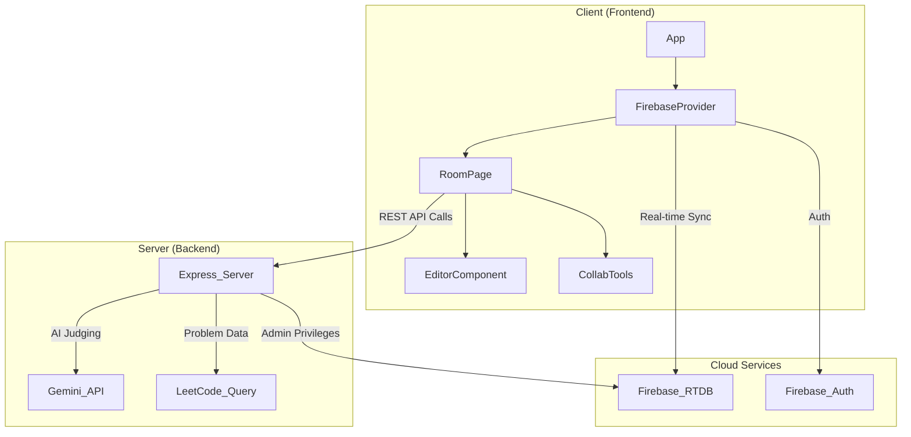

### Development Data Flow

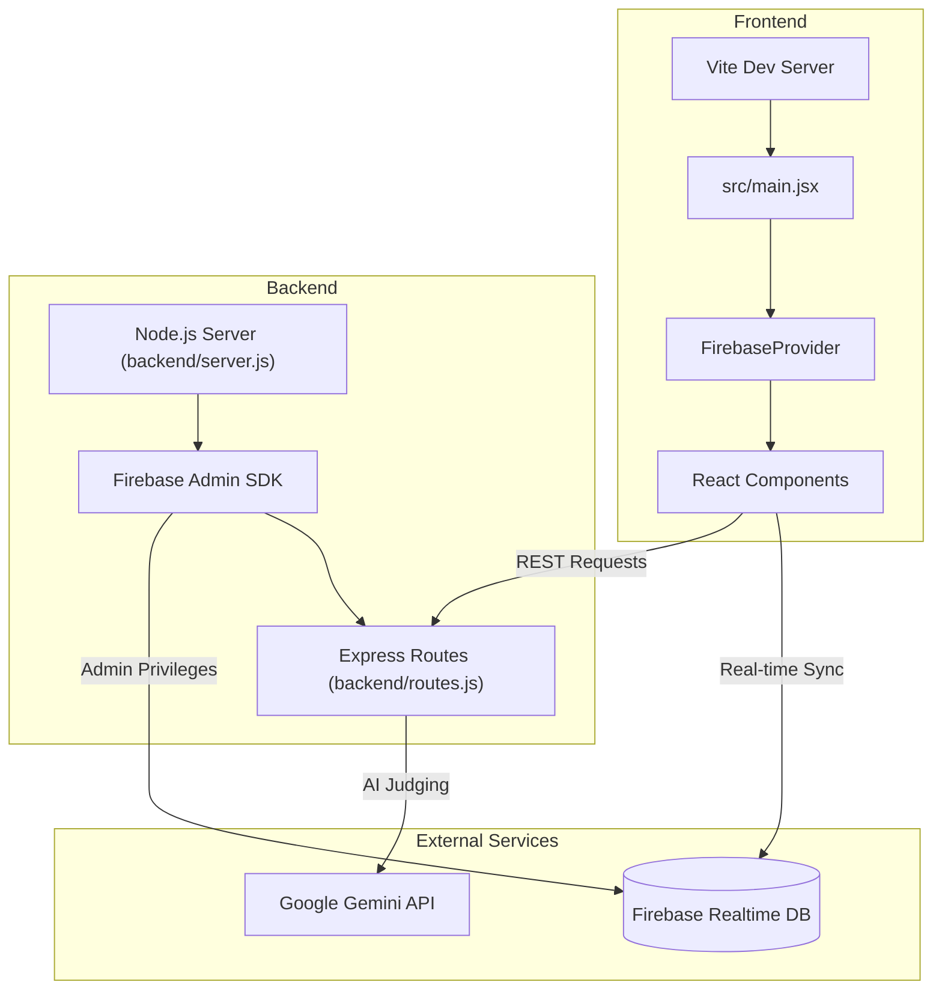

---

## Tech Stack

| Layer | Technologies |
| :--- | :--- |
| **Frontend** | React 19, Vite, Tailwind CSS, Monaco Editor |
| **Backend** | Node.js, Express |
| **Real-time / Database** | Firebase Realtime Database (RTDB) |
| **Authentication** | Firebase Auth (Google & Anonymous) |
| **AI / Logic** | Google Gemini 2.5 Flash Lite (judging), LeetCode-Query (problems) |
| **Communication** | Simple-Peer (WebRTC for Voice), Firebase (Chat/Whiteboard) |

---

## Key Features

1. **Session Management** — Users create or join rooms via a unique `roomId`. Session state is managed in Firebase under `root/rooms/{roomId}`.
2. **Collaborative Coding** — Monaco Editor with real-time sync. The Driver has write access; Observers have read-only views.
3. **AI Judging** — Code submissions are evaluated by the Gemini API, which generates test cases and evaluates correctness, complexity, and code quality.
4. **Integrated Tools** — Shared whiteboard for system design, live chat, and WebRTC-based voice communication.
5. **Driver-Observer Rotation** — Fair turn-based rotation ensures every participant gets to code.

---

## Project Structure

```
Code-Arena/
├── public/                  # Static assets
├── src/
│   ├── assets/              # Images, backgrounds
│   ├── pages/
│   │   ├── HomePage.jsx     # Landing page
│   │   ├── login_page.jsx   # Auth & room creation/join
│   │   ├── lobby.jsx        # Pre-game configuration
│   │   ├── results.jsx      # Post-game round history
│   │   ├── scores.js        # Scoring utilities
│   │   └── room/
│   │       ├── room.jsx     # Main session orchestrator
│   │       ├── editor.jsx   # Monaco Editor integration
│   │       ├── problem.jsx  # Problem display
│   │       ├── prob_picker.jsx  # Topic/difficulty picker
│   │       ├── prob_score.jsx   # AI judge results modal
│   │       ├── chat.jsx     # Live chat
│   │       ├── voicechat.jsx    # WebRTC voice
│   │       ├── whiteboard.jsx   # Shared canvas
│   │       ├── timer.jsx    # Countdown timer
│   │       └── scrollbar.css
│   ├── services/
│   │   ├── firebase.jsx     # Firebase provider & helpers
│   │   └── api.js           # HTTP client for backend
│   ├── App.jsx              # Root component & routing
│   ├── main.jsx             # Entry point
│   └── index.css
├── backend/
│   ├── server.js            # Express entry point
│   ├── routes.js            # API endpoints & AI judge
│   ├── controller.js        # Game state logic
│   ├── config/
│   │   └── firebase-admin.js  # Firebase Admin SDK init
│   ├── problem_set.json     # Cached problem data
│   ├── vercel.json          # Vercel serverless config
│   └── package.json
├── package.json
├── vite.config.js
├── tailwind / postcss configs
└── README.md
```

---

## Getting Started

### Prerequisites & Installation

```bash
# Clone the repository
git clone https://github.com/harshitzofficial/Code-Arena.git
cd Code-Arena

# Install frontend dependencies
npm install

# Install backend dependencies
cd backend
npm install
```

### Environment Configuration

The application requires **two** environment files (both are `.gitignore`d):

#### Frontend — `/.env`

| Variable | Description |
| :--- | :--- |
| `VITE_FIREBASE_API_KEY` | Firebase Web API Key |
| `VITE_FIREBASE_AUTH_DOMAIN` | Firebase project auth domain |
| `VITE_FIREBASE_DATABASE_URL` | Realtime Database URL |
| `VITE_FIREBASE_PROJECT_ID` | Firebase Project ID |
| `VITE_FIREBASE_STORAGE_BUCKET` | Firebase Storage bucket |
| `VITE_FIREBASE_MESSAGING_SENDER_ID` | Firebase Cloud Messaging ID |
| `VITE_FIREBASE_APP_ID` | Firebase App ID |

#### Backend — `/backend/credentials.env`

| Variable | Description |
| :--- | :--- |
| `FIREBASE_PROJECT_ID` | Firebase Project ID |
| `FIREBASE_PRIVATE_KEY` | Firebase Service Account Private Key (wrap in double quotes if it contains `\n`) |
| `FIREBASE_CLIENT_EMAIL` | Firebase Service Account Email |
| `FIREBASE_DATABASE_URL` | Realtime Database URL |
| `GEMINI_API_KEY` | API Key for Google Generative AI |

### Running the Development Servers

```bash
# Terminal 1 — Backend (from /backend)
node server.js
# Starts on http://localhost:3000 (or configured PORT)

# Terminal 2 — Frontend (from project root)
npm run dev
# Starts on http://localhost:5173
```

---

## Deployment & Infrastructure

Both frontend and backend are deployed on **Vercel** as independent entities.

### Frontend Deployment

The React/Vite app is deployed to Vercel, which handles the build process and serves static assets via its Edge Network. Firebase and backend API environment variables are configured in the Vercel dashboard.

### Backend Deployment (Serverless)

The Express backend is deployed as a **Vercel Serverless Function** via `backend/vercel.json`:

| Property | Value | Description |
| :--- | :--- | :--- |
| `version` | `2` | Vercel platform version |
| `builds` | `{"src": "server.js", "use": "@vercel/node"}` | Entry point for Node.js runtime |
| `routes` | `{"src": "/(.*)", "dest": "server.js"}` | Catch-all route to Express |

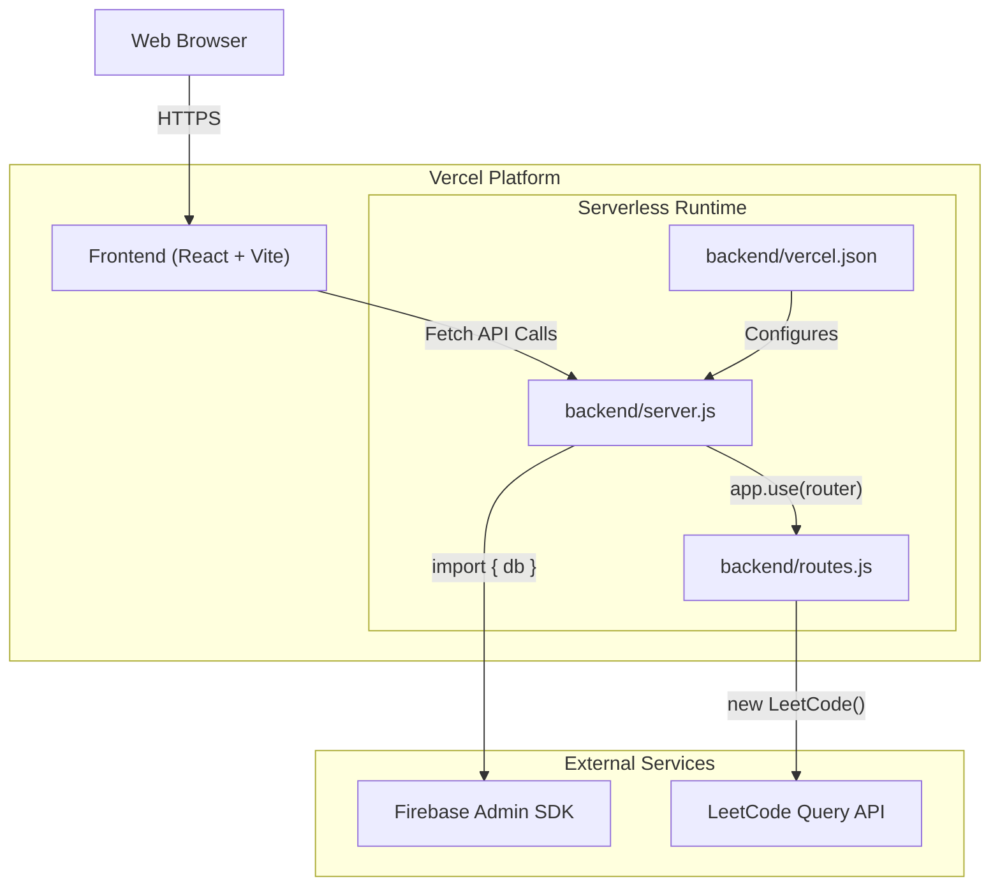

### CORS Configuration

The backend whitelists these origins in `backend/server.js`:

```javascript
app.use(cors({
  origin: [
    'http://localhost:5173',
    'https://codecolab-mlt4q71f8-shagun20s-projects.vercel.app',
    'https://codecolab-nu.vercel.app/'
  ]
}));
```

---

## Frontend Architecture

### Entry Point & Providers

The app bootstraps from `src/main.jsx`:

- **BrowserRouter** — Client-side routing via `react-router-dom`
- **FirebaseProvider** — Custom context injecting Firebase Auth & RTDB into the component tree
- **App** — Root component managing global auth state and the routing table

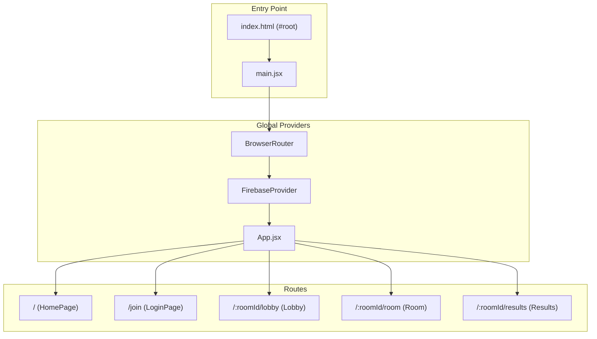

### Routing & Pages

| Path | Component | Description |
| :--- | :--- | :--- |
| `/` | `HomePage` | Landing page with feature overview and CTAs |
| `/join` | `LoginPage` | Google/Anonymous auth, room creation or join by ID |
| `/:roomId/lobby` | `Lobby` | Pre-game config (timer, problem count), participant sync |
| `/:roomId/room` | `Room` | Main collaborative IDE and problem-solving interface |
| `/:roomId/results` | `Results` | Post-game summary and round history |

#### User Journey

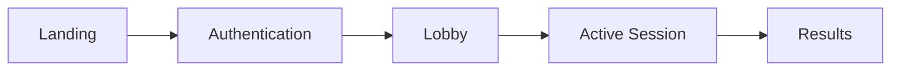

#### LoginPage Flow

The `LoginPage` uses a step-based UI (Steps 0-2):
- **Step 0**: Auth selection (Google Sign-In or Join by ID)
- **Step 1**: Username entry. Hosts trigger `sendHost()` which generates a 6-char `roomId` via `nanoid` and initializes the room in Firebase.
- **Step 2**: Room ID entry for participants joining existing rooms.

#### Lobby

The host configures session parameters (duration, problem count). When "Start Game" is clicked:
1. `createGame` calls the `/createGame` backend endpoint to seed the initial problem and game state.
2. Firebase `gameStatus` is set to `"started"`, triggering automatic navigation for all participants.

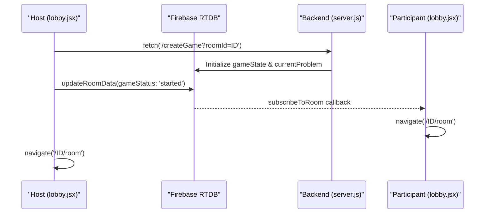

### Room — The Coding Session UI

The `Room` component (`src/pages/room/room.jsx`) is the central orchestrator. It subscribes to Firebase and manages transitions between round statuses.

#### Session State Machine

| `roundStatus` | Component Rendered | Description |
| :--- | :--- | :--- |
| `initialising` | Loading Overlay | Fetching initial room data |
| `selecting` | `ProblemPicker` | Driver chooses topic and difficulty |
| `coding` | `Editor` + `Problem` | Active coding phase |
| `running` | `Editor` (Disabled) | Code being evaluated by AI Judge |
| `completed` | `ProblemScore` | AI judge results displayed |

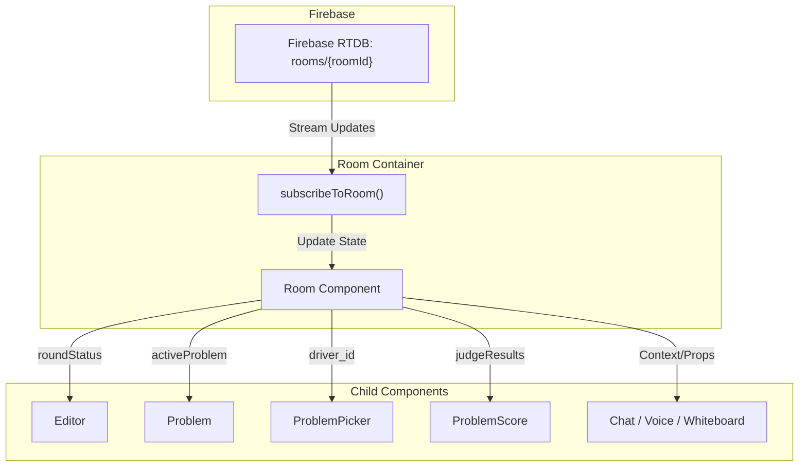

#### Driver vs Observer Communication

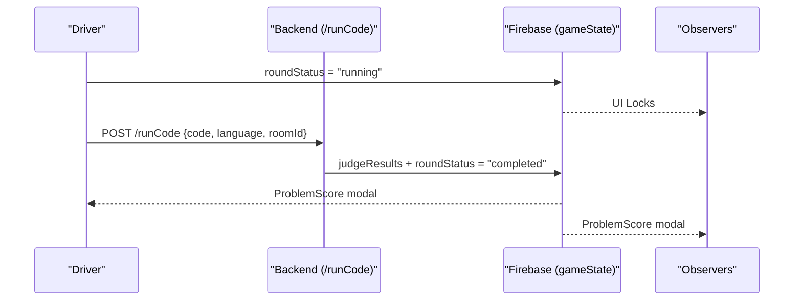

### Code Editor Component

`src/pages/room/editor.jsx` integrates the **Monaco Editor** with real-time sync.

- **Driver Mode**: Interactive editor. Changes trigger debounced writes to Firebase (300ms).
- **Observer Mode**: Read-only. Auto-updates from Firebase events.
- **Per-Language State**: Code stored as `codeByProblem[problemId][language]` — switching languages preserves progress.
- **Timer**: `src/pages/room/timer.jsx` uses a flip-clock countdown. On expiry, auto-submits current code.

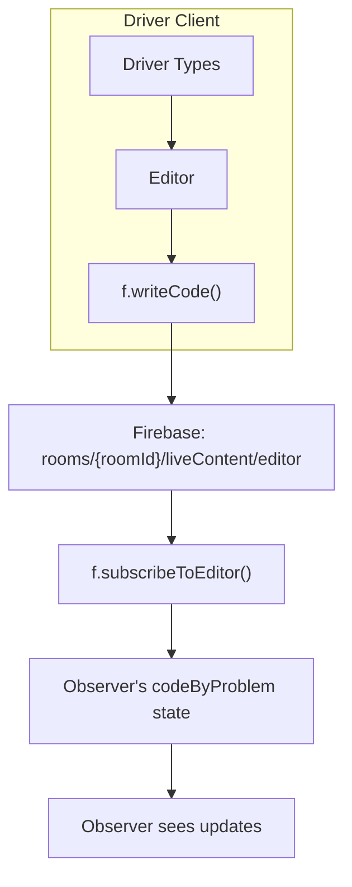

### Problem Display & Problem Picker

- **`problem.jsx`**: Renders LeetCode problem HTML via `dangerouslySetInnerHTML`. Supports focused (full-height) and sidebar modes.
- **`prob_picker.jsx`**: Modal for the Driver to select topic + difficulty. "Confirm Selection" triggers `/fetchProblem` API call.

### Scoring, Results & Round History

- **`prob_score.jsx`**: Post-execution modal showing pass/fail status, score (0-100), time/space complexity, AI analysis, and per-test-case breakdown. Only the Driver can trigger "Next Problem" or "Try Again".
- **`results.jsx`**: End-of-session recap. Fetches `roundHistory` from Firebase, displays expandable round cards and team success metrics.

### Collaboration Tools — Chat, Voice & Whiteboard

#### Live Chat (`chat.jsx`)
- Push-based messaging via Firebase `onChildAdded`
- Messages contain `sender_id`, `sender`, `text`, `timestamp`
- Uses `boring-avatars` for participant identification

#### Voice Chat (`voicechat.jsx`)
- **WebRTC** via `simple-peer` for P2P audio
- **Firebase as signaling server**: presence at `voice/presence/{userId}`, signals at `voice/signals/{toId}/{fromId}`
- **Speaking detection** via Web Audio API (`AudioContext` + `AnalyserNode`)

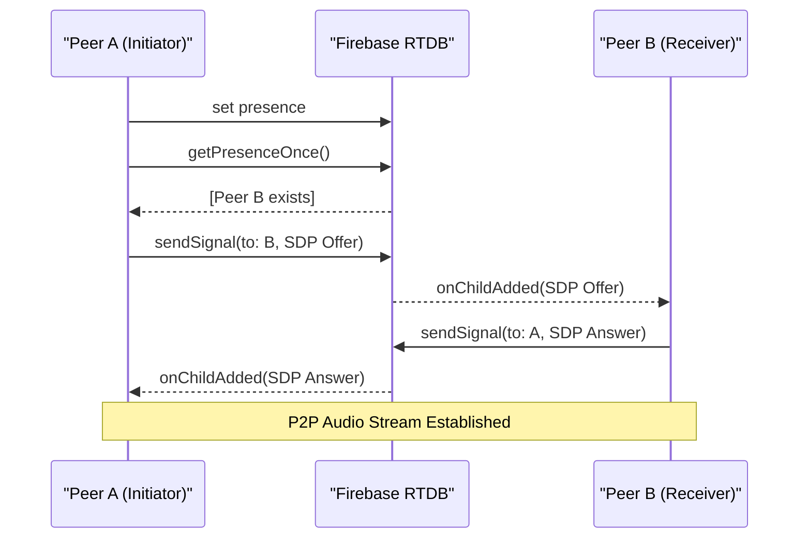

#### Shared Whiteboard (`whiteboard.jsx`)
- Stroke-based sync (not pixel-based) for efficiency
- **Dual canvas**: `overlayRef` for local feedback, `canvasRef` for permanent strokes
- Strokes pushed to Firebase on `onPointerUp`, rendered on all clients via `subscribeToWhiteboardStrokes`
- Supports pen/eraser tools and room-wide clear

### Frontend Services Layer

#### Firebase Service (`src/services/firebase.jsx`)

| Function | Firebase Path | Purpose |
| :--- | :--- | :--- |
| `subscribeToRoom` | `root/rooms/{roomId}` | Game state changes |
| `subscribeToEditor` | `root/liveContent/{roomId}/editor/` | Code, language, typing status sync |
| `subscribeToChat` | `root/liveContent/{roomId}/chat/` | New messages via `onChildAdded` |
| `subscribeToWhiteboardStrokes` | `root/liveContent/{roomId}/whiteboard/strokes` | Canvas stroke objects |
| `writeCode` | `root/liveContent/{roomId}/editor/` | Driver writes code |
| `sendMsg` | `root/liveContent/{roomId}/chat/` | Push new chat message |
| `pushWhiteboardStroke` | `root/liveContent/{roomId}/whiteboard/strokes` | Push stroke |
| `updateRoomData` | `root/rooms/{roomId}` | Partial game state update |
| `getRoomData` | `root/rooms/{roomId}` | One-time fetch |
| `writeRoomData` | `root/rooms/{roomId}` | Full room overwrite (creation) |
| `writeUserData` | `root/users/{uid}` | User profile storage |
| `clearWhiteboard` | `root/liveContent/{roomId}/whiteboard/strokes` | Remove all strokes |

Authentication: Google Sign-In (`signInWithPopup`) and Anonymous Auth (`signInAnonymously`).

#### HTTP API Client (`src/services/api.js`)

Thin `fetch` wrapper pointing at the backend (`http://localhost:3000/`). All requests use `POST` with JSON payloads.

---

## Backend Architecture

The backend is a modular **Node.js/Express** application.

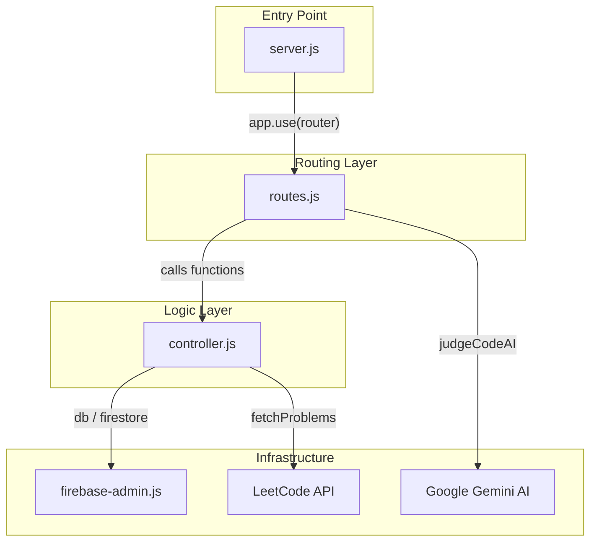

### API Routes & AI Judge

Defined in `backend/routes.js`:

| Endpoint | Method | Purpose |
| :--- | :--- | :--- |
| `/createGame` | `GET` | Initialize a new game session |
| `/nextRound` | `GET` | Reset state, prepare next round |
| `/fetchProblem` | `GET` | Fetch problem by topic + difficulty |
| `/runCode` | `POST` | Run or Submit code for AI evaluation |

### AI Test-Case Generation

`fetchTestCasesFromAI` uses **Gemini 2.5 Flash Lite** to generate test cases on-the-fly:
- Covers edge cases (empty input, single elements, negatives)
- Large stress inputs and boundary values
- Returns JSON array with `stdin` and `expected` fields

### AI Judging Pipeline

`judgeCodeAI` operates in two modes:

| Mode | Trigger | Behavior |
| :--- | :--- | :--- |
| **Run** | User clicks "Run" | Mentally executes code against sample test cases |
| **Submit** | User clicks "Submit" | Full evaluation against AI-generated hidden test cases with complexity analysis |

Submit mode enforces:
- **Code Sanity**: Detects empty/dummy functions
- **Complexity Guard**: Caps score at 60 for sub-optimal algorithms
- **Logical Validation**: Step-through execution for every hidden case

#### Response Schema

| Field | Type | Description |
| :--- | :--- | :--- |
| `overallStatus` | String | "Accepted", "WA", "TLE", "Runtime Error" |
| `score` | Number | 0-100 |
| `complexity` | Object | `{ time: "O(n)", space: "O(1)" }` |
| `testReport` | Array | Per-test-case breakdown (input, expected, actual, passed) |
| `analysis` | String | Natural language explanation of performance |

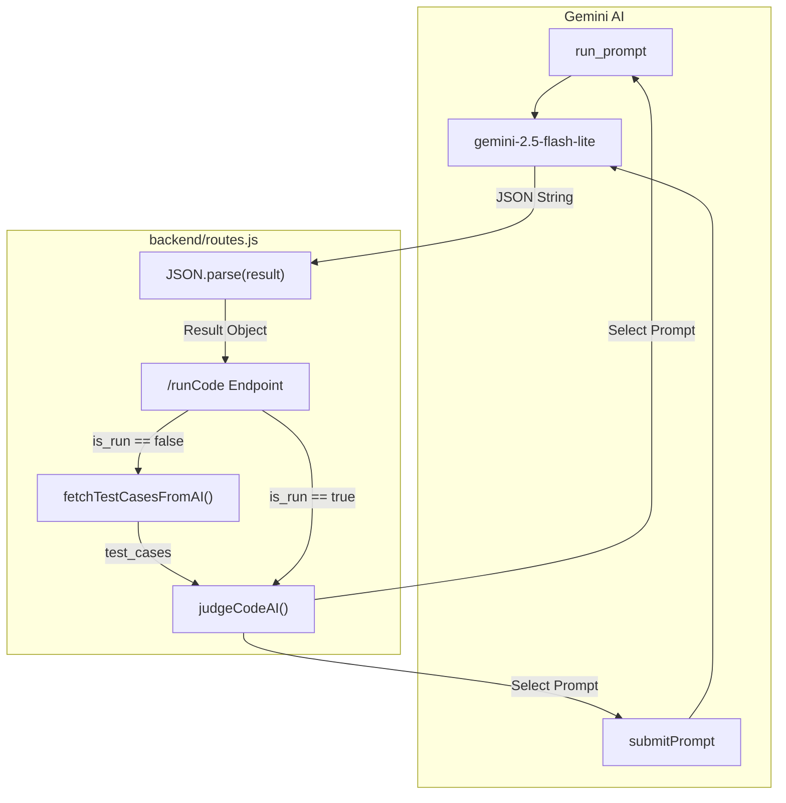

### Game State Controller

`backend/controller.js` manages the full game lifecycle:

#### Problem Seeding
- `seedDatabase()` fetches ~2000 problems from LeetCode via `leetcode-query` and caches them in Firebase under `problemList/`.
- `fetchProblems()` retrieves from cache; auto-seeds if empty.

#### Game Initialization
- `initGame(roomId)` loads problems, extracts topic tags, and calls `chooseDriver()`.

#### Driver Rotation
- `chooseDriver(roomId)` sorts participant IDs alphabetically for deterministic rotation, selects the next in line.

#### Round State Machine

| Status | Triggering Function | Description |
| :--- | :--- | :--- |
| `lobby` | Initial State | Waiting for host |
| `coding` | `setProblem` | Problem + timer set |
| `executed` | `runCode` | Results stored in `judgeResults` |
| `submitted` | `submitCode` | Results archived to `roundHistory` |

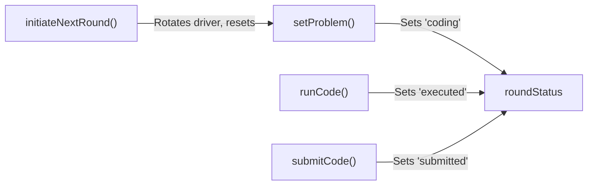

- `setProblem(roomId, topic, difficulty)` — Picks a random unseen problem, fetches full details, calculates timer, updates Firebase.
- `runCode` — Stores AI judge output in `gameState/judgeResults`.
- `submitCode` — Archives to `roundHistory`, finalizes round.
- `initiateNextRound` — Rotates driver, resets state for next problem.

### Firebase Admin & Backend Configuration

`backend/config/firebase-admin.js` initializes the Firebase Admin SDK:

1. Loads `credentials.env` via `dotenv`
2. Sanitizes `FIREBASE_PRIVATE_KEY` (replaces escaped `\n` with real newlines)
3. Calls `admin.initializeApp()` with service account credentials
4. Exports handles: `db` (RTDB), `firestore`, `auth`

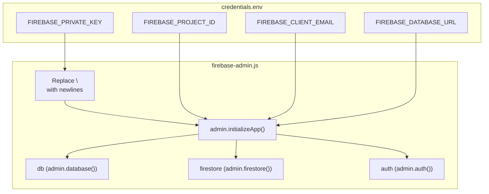

### Backend Dependencies

| Package | Purpose |
| :--- | :--- |
| `express` | Web framework for API routing |
| `firebase-admin` | Server-side Firebase access |
| `leetcode-query` | Fetching problem data from LeetCode |
| `@google/generative-ai` | Gemini AI for judging |
| `cors` | Cross-Origin Resource Sharing |
| `dotenv` | Environment variable management |

---

## Data Architecture & Firebase Schema

The database is organized under a `root` node with four primary subtrees:

```
root/
├── rooms/{roomId}/          # Session state
│   ├── host_id
│   ├── config/
│   │   ├── timer            # Round duration (minutes)
│   │   └── max_prob         # Total problems in session
│   ├── gameState/
│   │   ├── gameStatus       # "waiting" | "started" | "ended"
│   │   ├── roundStatus      # "initialising" | "selecting" | "coding" | "running" | "executed" | "completed"
│   │   ├── driver_id
│   │   ├── participants_list/
│   │   ├── currentProblem/
│   │   ├── judgeResults/
│   │   ├── timerStartTime
│   │   ├── timerEndTime
│   │   └── gameUrl
│   └── roundHistory/
│       └── round_N/
│           ├── score
│           ├── analysis
│           ├── driver_id
│           └── problem_title
├── liveContent/{roomId}/    # High-frequency transient data
│   ├── editor/
│   │   ├── code
│   │   ├── language
│   │   ├── questionId
│   │   ├── updatedAt
│   │   └── status/ { typing, driver }
│   ├── chat/
│   │   └── {pushKey}/ { sender_id, sender, text, timestamp }
│   ├── whiteboard/
│   │   └── strokes/
│   │       └── {pushKey}/ { points[], tool, lineWidth, author }
│   └── voice/
│       ├── presence/{userId}/ { username, joinedAt }
│       └── signals/{toId}/{fromId}/ { signal }
├── users/{uid}/             # User profiles
└── problemList/             # Cached LeetCode problems (~2000)
    └── {index}/ { id, title, titleSlug, difficulty, tags[] }
```

### Room & Game State Schema

The `root/rooms/{roomId}` node is the source of truth for the game lifecycle. The `roundStatus` field drives UI rendering:

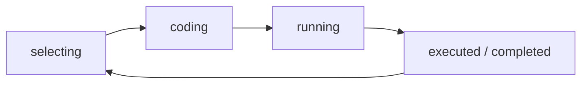

### Live Content Schema (Editor, Chat, Whiteboard, Voice)
The `root/liveContent/{roomId}` subtree handles high-frequency, ephemeral data for real-time collaboration. Unlike the `rooms` node (game state), `liveContent` manages streaming data between the Driver and Observers.

#### Editor Node (`liveContent/{roomId}/editor/`)

| Field | Type | Description |
| :--- | :--- | :--- |
| `questionId` | String | LeetCode ID of the current problem |
| `language` | String | Currently selected language (e.g., "JavaScript", "Python3") |
| `code` | String | Full editor content |
| `status` | Object | `{ typing: Boolean, driver: String }` — activity indicators |
| `updatedAt` | Timestamp | Last modification time |

The Driver writes via a **debounced function** (300ms) to avoid overwhelming the database. Observers listen via `subscribeToEditor` (`onValue` events).

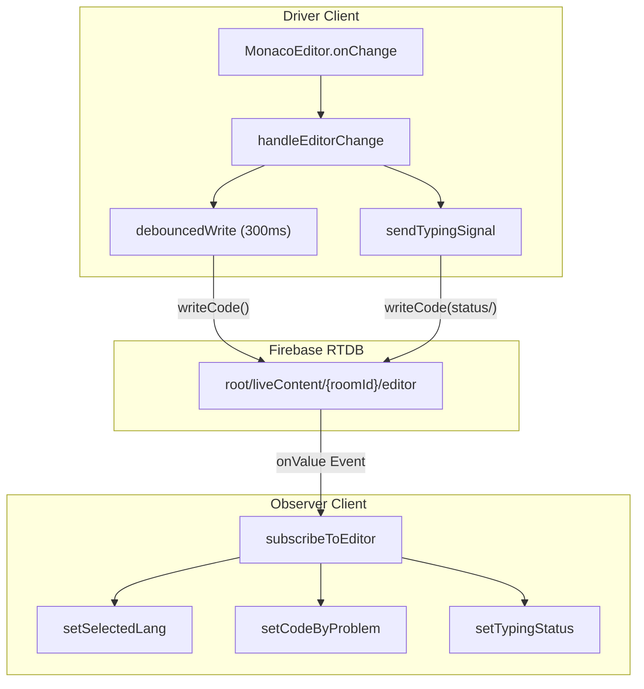

#### Chat Node (`liveContent/{roomId}/chat/`)

Uses Firebase `push()` for chronologically ordered messages. Each message is a push-keyed object:

| Field | Type | Description |
| :--- | :--- | :--- |
| `sender_id` | String | Unique ID of the sender |
| `sender` | String | Display name of the sender |
| `text` | String | Message content |
| `timestamp` | Number | `Date.now()` when sent |

The `Chat` component uses `subscribeToChat` with `onChildAdded` to efficiently receive only new messages rather than the entire history.

#### Whiteboard Node (`liveContent/{roomId}/whiteboard/strokes/`)

Stroke-based (vector) sync rather than pixel-based, for efficiency. Each stroke is a push-keyed object:

| Field | Type | Description |
| :--- | :--- | :--- |
| `points` | Array | `[{x, y}, ...]` coordinates of the path |
| `tool` | String | `"pen"` or `"eraser"` |
| `lineWidth` | Number | Thickness of the stroke |
| `author` | String | Username of the drawer |

**Drawing lifecycle:**
1. While drawing, the path renders on an `overlayRef` canvas for immediate local feedback.
2. On `onPointerUp`, the completed stroke is pushed to Firebase via `pushWhiteboardStroke`.
3. All clients render incoming strokes onto the permanent `canvasRef` via `subscribeToWhiteboardStrokes`.

#### Voice & Presence Nodes

Voice uses **WebRTC** (`simple-peer`) with Firebase as the signaling server.

| Path | Schema | Purpose |
| :--- | :--- | :--- |
| `voice/presence/{userId}` | `{ username, joinedAt }` | Discover active peers in the voice channel |
| `voice/signals/{toId}/{fromId}` | `{ signal }` | WebRTC offer/answer/ICE candidate exchange |

Signals are consumed and deleted after processing.

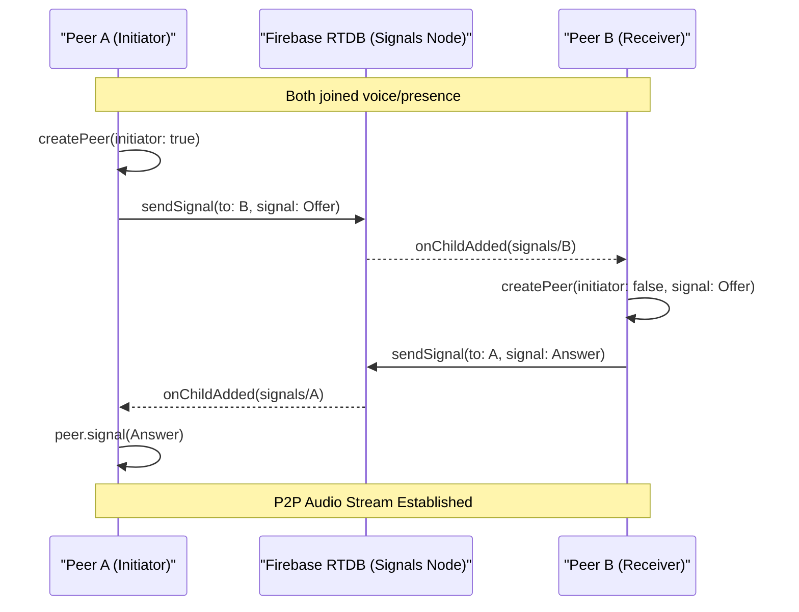

Key voice functions:
- **`join()`** — Requests mic access, sets presence, initiates peer connections with existing users.
- **`subscribeToSignals()`** — Listens for incoming WebRTC handshakes for the local user.
- **`setupSpeakingDetector()`** — Uses `AudioContext` + `AnalyserNode` to detect volume and show "speaking" indicators.

---

## Glossary

| Term | Definition |
| :--- | :--- |
| **Driver** | The participant currently responsible for writing code. Has exclusive write access to the editor, can select problems, trigger execution, and initiate the next round. Rotates after each round. |
| **Observer** | Any non-Driver participant. Their editor is read-only; they watch the Driver's code in real time. |
| **AI Judge** | LLM-powered evaluation engine (Gemini 2.5 Flash Lite) that replaces traditional sandboxed execution. Operates in **Run** mode (sample test cases) and **Submit** mode (hidden test cases with complexity analysis). |
| **Room** | A unique session identified by a `roomId`, encompassing game state, participants, and all real-time collaborative content. |
| **Problem Seeding** | Fetching ~2000 problems from the LeetCode API and caching them in Firebase under `problemList/` for fast access. |
| **Round Status** | A state machine value (`initialising`, `selecting`, `coding`, `running`, `executed`, `completed`) that dictates which UI components are visible. |
| **Presence** | A real-time record of which users are active in a specific feature (e.g., Voice Chat). Stored at `voice/presence/{userId}`. |
| **Signalling** | The exchange of WebRTC offer/answer metadata via Firebase to establish a P2P voice connection. Stored at `voice/signals/{toId}/{fromId}`. |
| **Slug** | A URL-friendly version of a problem title (e.g., `two-sum`) used to query specific problem details from LeetCode. |

### System Entities Mapping

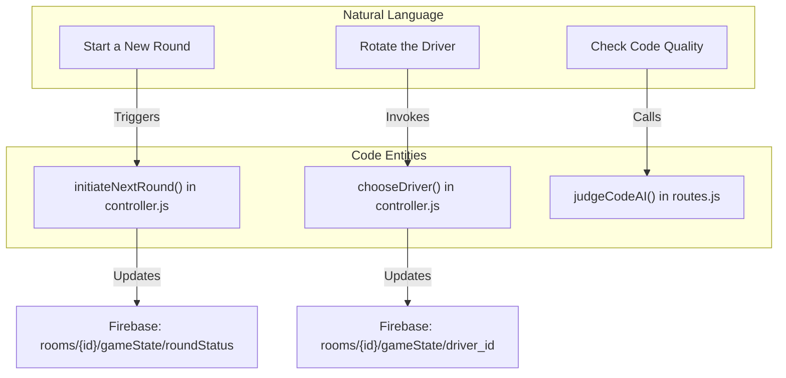

### Collaborative Feature to Firebase Path Mapping

```mermaid
graph LR
    subgraph "Feature"
        Editor["Code Editor"]
        Chat["Room Chat"]
        WB["Whiteboard"]
        Voice["Voice Signalling"]
    end

    subgraph "Firebase RTDB Path"
        Editor --- P1["root/liveContent/{roomId}/editor"]
        Chat --- P2["root/liveContent/{roomId}/chat"]
        WB --- P3["root/liveContent/{roomId}/whiteboard/strokes"]
        Voice --- P4["root/liveContent/{roomId}/voice/signals"]
    end

    subgraph "Service Function"
        P1 --> S1["writeCode()"]
        P2 --> S2["sendMsg()"]
        P3 --> S3["pushWhiteboardStroke()"]
        P4 --> S4["sendSignal()"]
    end
